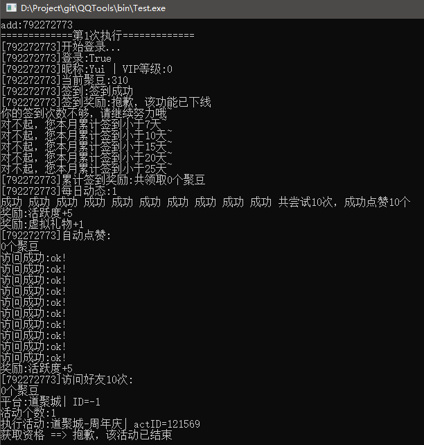

# QQTools

QQ各种游戏Web活动的撸蚊子腿工具。


### 更新日志

2019.11.3 更新了QQ登录、道聚城签到


### 设计理念

我酷爱玩dnf这款游戏，这游戏有很多蚊子腿活动，费时费力最终只能得到一些小奖励。

懒是第一动力，写了这个工具来自动撸蚊子腿。


### 框架

由"WebQQ登录"、"QQActive框架"、"定时器"三部分组成。


#### WebQQ登录协议

​	分析qq.com主页的登录流程，抓出了加密密码的函数（JavaScript），经过修补后用C#调用js文件(c_login_2_Encription.js)里的密码密文生成函数，再自己post进行登录，拿到token。此token适用于大部分web活动、APP活动（感谢QQ token跨平台机制）。

#### QQActive框架

​	分析了几个活动的流程，总结出一套适用性较强的框架。QQ自身有一套活动框架（AMS），并且正在逐渐普及。使用了此框架的活动只需要定义好活动信息，就可以自动去执行，例如心悦dnf专区的几个活动

```C#
private void InitActivity()
{
	string[] str = new string[] { "worldid=" + wordid };
	p.ActivityList = new List<QQActivity>()
	{
		
		new QQActivity()
		{
			Name = "心悦-大悦谷-淬金池",
			ActiveId = 116090,
			FlowList = new List<QQActivity>()
			{
				new QQActivity() { Name = "签到", ActiveId = 378208, OtherParams = new string[] { "param=620717","source=1","" } },
				//new QQActivity() {Name = "分享给好友", ActiveId=380706 ,OtherParams = new string[] {"param=620711"}, ActionList = new List<Action>() { 分享到QQ空间 } },
				//new QQActivity() {Name = "分享到QQ空间",ActiveId = 380706,OtherParams = new string[] { "param=620710" } }
			}
		},
		new QQActivity()
		{
			Name = "心悦-勇士币",
			ActiveId = 110177,
			FlowList = new List<QQActivity>()
			{
				new QQActivity() {Name = "每日抽奖",ActiveId = 359785 },        //抽两次
				new QQActivity() {Name = "每日抽奖",ActiveId = 359785 }         //抽两次
			}
		},
		new QQActivity()
		{
			Name = "心悦-勇士之路",
			ActiveId = 117729,
			FlowList = new List<QQActivity>()
			{
				 new QQActivity() {Name = "每周一测",ActiveId = 383114, OtherParams = str},
				 new QQActivity() {Name = "A级礼包",ActiveId = 383825, OtherParams = str},
				 new QQActivity() {Name = "S级礼包",ActiveId = 383828, OtherParams = str},
				 new QQActivity() {Name = "至强礼包",ActiveId = 383829, OtherParams = str},
			}
		},
		new QQActivity()
		{
			Name = "心悦-每日任务",
			ActiveId = 54842,
			FlowList = new List<QQActivity>()
			{
				new QQActivity() {Name = "通过地下城四次(双倍)",ActiveId = 282373  },
				new QQActivity() {Name = "通过地下城四次",ActiveId = 281054  },
				new QQActivity() {Name = "安图日常三次",ActiveId = 319631  },
				new QQActivity() {Name = "游戏内消耗疲劳值120",ActiveId = 280666  },
				new QQActivity() {Name = "游戏内PK3次",ActiveId = 280671  },
				new QQActivity() {Name = "安图日常两次",ActiveId = 319630  },
				new QQActivity() {Name = "游戏内消耗疲劳值50",ActiveId = 280664  },
				new QQActivity() {Name = "游戏内在线时长40",ActiveId = 280663  },
				new QQActivity() {Name = "游戏内PK2次",ActiveId = 280670  },
				new QQActivity() {Name = "游戏内在线时长30",ActiveId = 280660  },
				new QQActivity() {Name = "邮箱无未读邮件",ActiveId = 280631  },
				new QQActivity() {Name = "通关绝望之塔",ActiveId = 327341  },
				//new QQActivity() {Name = "游戏内消耗疲劳值10",ActiveId = 280499  },
				//new QQActivity() {Name = "游戏内在线时长15", ActiveId=280463 },
				//new QQActivity() {Name = "赠送双倍卡", ActiveId = 280743 },
				//new QQActivity() {Name = "游戏内PK1次",ActiveId = 280505  },
				//new QQActivity() {Name = "独立kill怪物",ActiveId = 280638  },
				//new QQActivity() {Name = "每日登录抽奖任务",ActiveId = 280706  },
				//new QQActivity() {Name = "通关异界两次",ActiveId = 319591  },
				//new QQActivity() {Name = "通关异界三次",ActiveId = 319617  },
				//new QQActivity() {Name = "安图日常一次",ActiveId = 319629  },
				//
			}
		}
	};
}
```

然后这样执行：

```C#
InitActivity();
QQEntity.AMSAuto(p);
```

特殊活动也提供了自定义执行任务的框架。

#### 定时器

​	定时器负责执行定时任务，例如每天晚上11:30时执行一次心悦-每日任务，获取"通过地下城四次(双倍)"奖励。


#### 功能列表

1. 道聚城APP

   1) 查询聚豆

   2) 每日签到、领取每日签到奖励

   3) 领取累计签到奖励

   4) 发表随机动态、领取奖励

   5) 点赞10个陌生人、领取奖励

   6) 访问10次好友、领取奖励

   7) 周年庆签到（活动已结束）

2. DNF心悦-大悦谷(活动已结束)

   1) 签到

   2) 分享到QQ空间

   3) 每日抽奖（2次）

   4) 勇士之路-每周一测

   5) 勇士之路-领取每月A、S、至强礼包

   6) 每日任务-所有高分任务从高到低尝试完成

3. DNF助手(活动已结束)

   1) 每日在线30分钟签到


#### 使用方法

1.配置QQ账号信息

​	QQ账号信息在exe文件同目录下的qq.txt文件内，json格式，支持多账号。例如：

```json
[
["792272773","123456"],
["10000","123456"],
]
```

其中有两个账号，分别是792272773、10000，他们的密码都是123456。

2.把东西放服务器上，执行。


#### 执行结果

